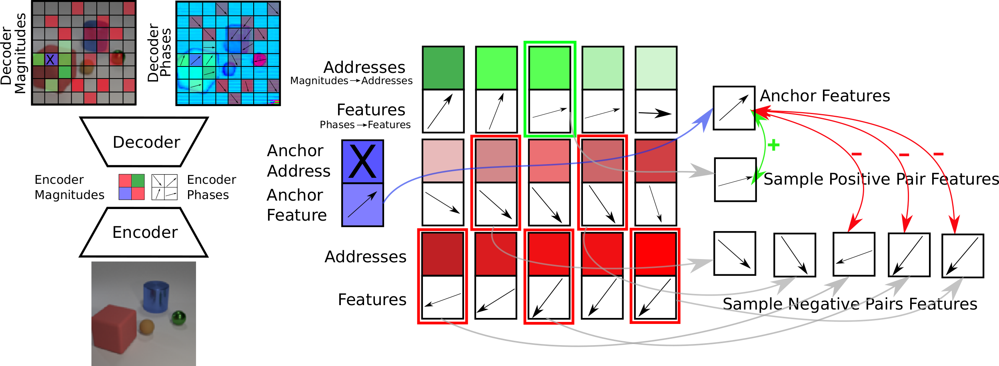
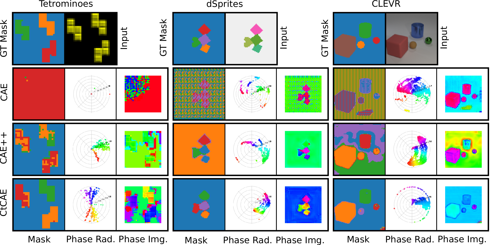

# Contrastive Training of Complex-Valued Autoencoders for Object Discovery

Current state-of-the-art object-centric models use slots and attention-based routing for binding. However, this class of models has several conceptual limitations: the number of slots is hardwired; all slots have equal capacity; training has high computational cost; there are no object-level relational factors within slots. Synchrony-based models in principle can address these limitations by using complex-valued activations which store binding information in their phase components. However, working examples of such synchrony-based models have been developed only very recently, and are still limited to toy grayscale datasets and simultaneous storage of less than three objects in practice. Here we introduce architectural modifications and a novel contrastive learning method that greatly improve the state-of-the-art synchrony-based model. For the first time, we obtain a class of synchrony-based models capable of discovering objects in an unsupervised manner in multi-object color datasets and simultaneously representing more than three objects.

This repo provides a reference implementation for the CtCAE as introduced in our paper "Contrastive Training of Complex-Valued Autoencoders for Object Discovery" ([https://arxiv.org/abs/2305.15001](https://arxiv.org/abs/2305.15001)).

---------------------------------



---------------------------------



---------------------------------


## Setup

To download the data use the linke provided on the EMORL GitHub repository: [https://github.com/pemami4911/EfficientMORL](https://github.com/pemami4911/EfficientMORL), or directly from here: [https://zenodo.org/records/4895643](https://zenodo.org/records/4895643).
Store the `*.h5` files to `data` directory in this repository.

Use the `requirements.txt` to install the necessary packages, e.g. run `pip3 install -r requirements.txt`.


## Run Experiments

To train and test the CtCAE on 32x32 resolution, run one of the following commands, depending on the dataset you want to use:

```python3 train.py --profile=ctcae_tetrominoes```

```python3 train.py --profile=ctcae_dsprites```

```python3 train.py --profile=ctcae_clevr```

To run training and test on the original resolution (64x64 for `multi_dpsrites` and 96x96 for `CLEVR`), run the following commands:

```python3 train.py --profile=ctcae_dsprites_64x64```

```python3 train.py --profile=ctcae_clevr_96x64```

To run training and test for CAE++ and CAE baselines, simply replace `ctcae` in the above commands with `caepp` and `cae` respectively (e.g. `python3 train.py --profile=caepp_clevr` to run CAE model on CLEVR dataset).
See `train.py` script for details on all run profiles.

## Citation
When using this code, please cite our paper:

```
@inproceedings{stanic2023contrastive,
  title={Contrastive Training of Complex-Valued Autoencoders for Object Discovery},
  author={Stani{\'c}, Aleksandar and Gopalakrishnan, Anand and Irie, Kazuki and Schmidhuber, J{\"u}rgen},
  booktitle={Proc. Advances in Neural Information Processing Systems (NeurIPS), 2023},
  year={2023}
}
```

## Contact
For questions and suggestions, feel free to open an issue on GitHub or send an email to [anand@idsia.ch](mailto:anand@idsia.ch) or [aleksandar.stanic@gmail.com](mailto:aleksandar.stanic@gmail.com).
